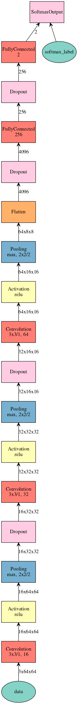
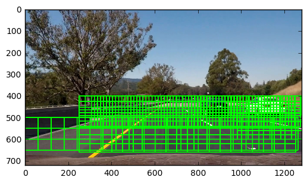
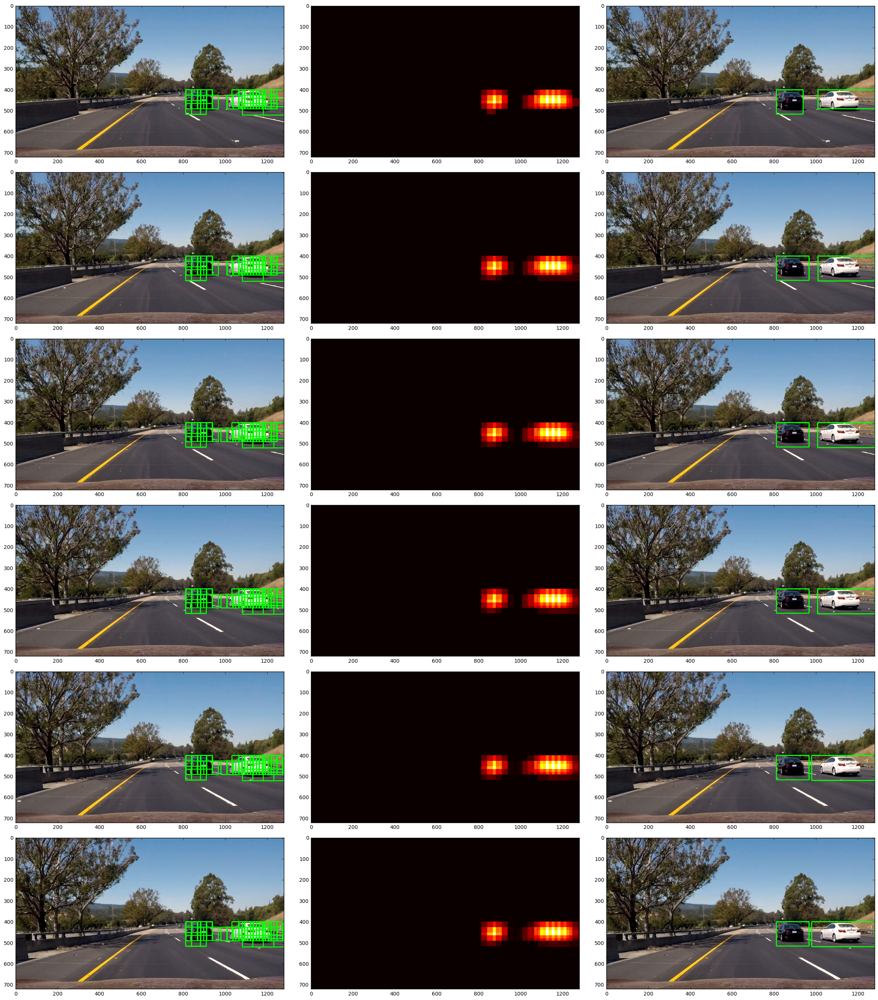

## Training a classifier

   At my first approach, I follow the instructions described in the course, experimenting different feature combinations, such as HOG, different color space, as well as different classifiers such as decision tree, svm, random forest. They are very interesting and I learned a lot. And some of them provided very good testing accuracy, especially random forest with HOG and LUV color space. However, I am also very curious about the performance of neural networks in this project. Thus I tried the following network as classifier and it provides me with remarkable results (about 0.2% higher than random forest). With gpu (GTX1060), the final pipeline is 10 times faster than sklearn methods, which help me a lot during tuning parameters of sliding windows. 
   
   Excluding using neural network as the classifier which does not require much hand-work for feature extracting, other parts of the pipeline remains the same as that introduced in the course.
   
   Since I am already quite familiar with tensorflow and keras, I tried another framework, mxnet, for this project. 
There are three convolutional layers for feature extracting and a two-fullyconnected classifier. The learning method is Adam. 

The details of the network architecture as follows:

## Sliding Window Search
Say the full image size is 1280*720. Consiering the images in the video, I focused on the lower half of the image, and larger boxes for lower parts, smaller boxes for upper parts.
Concretely, 
In the region of 500-670 (y-axis), I choose two different size of boxes (120*100, 100*80) with overlap of 0.5.
From 400-550, I choose smaller boxes (70, 65) with overlap of 0.6.
(I adjusted these parameters according the failure regions of the algorithm.)

Here is the all boxes I feed to the classifier:

## Processing Steps
1. find out all interested bounding boxes;
2. crop all interested regions of the given image.
3. feed them to the classifier, and find out whose probability is above the threshold (say 0.65), and record the positive windows;
4. these detected windows of the current image are stored in a Windows class, and the max records is say 10, meaning to store the detected windows of the last ten images.
5. apply the heatmap method introduced in the course to all recorded windows, and find out the regions that are greater than the heat threshold (say 12).
6. drawback the detected bboxes to original image.

Here are some examples, 

first column: with all detected windows;
second column: heat map;
third column: windows after applying heatmap threshold.

## Discussion

The most challenge problem I encountered is the unstable bounding boxes. I tried to tune parameters to improve it, but it is still not quite satisfying. Another problem is that the cars detected not accurate enough. Also the performance is still slow. Especially, for high speed driving, it is thoroughly not enough. 

The method I used in this project I have discussed above. Object detection is a very interesting problem, and to go further in this problem, I would like to try some algorithms such as yolo9000 and faster-RCNN (maybe for this two-catagory problem, RPN only is enough). I think these algorithms must be able to accerate the processing speed.
